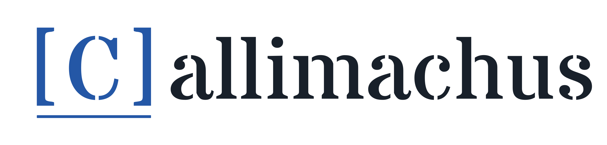
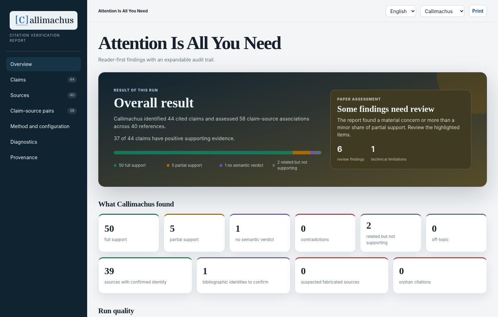
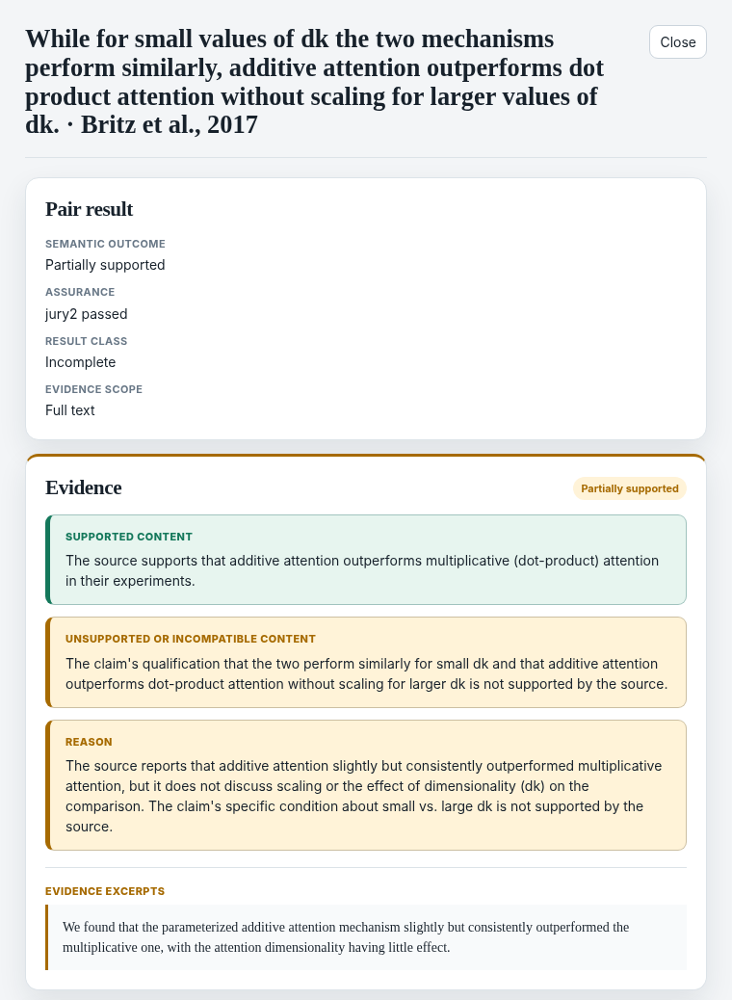
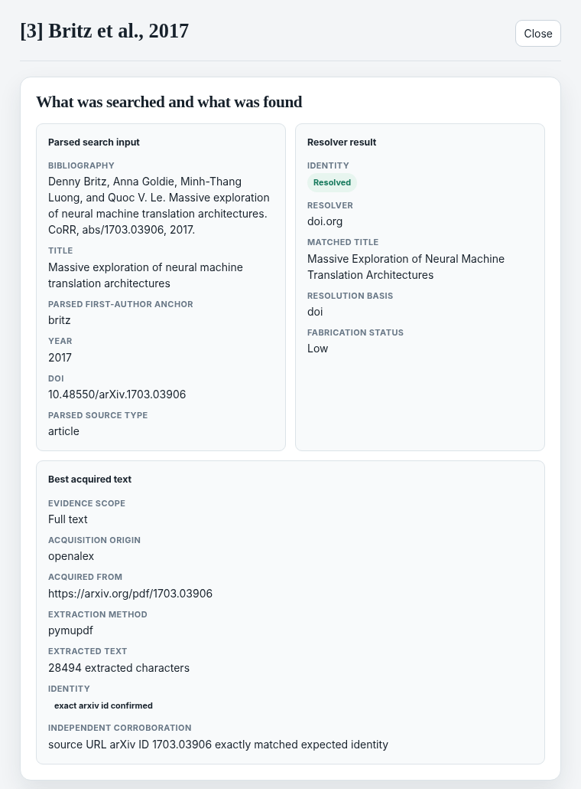
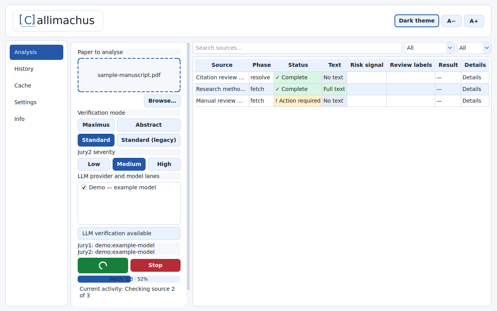

<p align="center">
  <picture>
    <source media="(prefers-color-scheme: dark)" srcset="assets/readme/logo-dark.png">
    
  </picture>
</p>

<p align="center"><strong>Citation Verifier</strong></p>
<p align="center">Check whether your sources support what you wrote.</p>

<p align="center">
  <a href="https://callimachus.science/">Website</a> ·
  <a href="#quick-start">Quick start</a> ·
  <a href="https://callimachus.science/demo/attention/">Example report</a> ·
  <a href="#what-it-checks">What it checks</a> ·
  <a href="docs/guide/README.md">Documentation</a>
</p>

A reference can be real and still fail to support the sentence that cites it.

**Callimachus checks a manuscript against its cited sources.** It identifies references, retrieves available text, and assesses whether that text supports the claims. The result is a browsable report: findings, evidence passages, and the gaps that still need attention.

**Manuscript formats:** Word (`.docx`), LaTeX, PDF, Markdown, plain text, and HTML.

<p align="center">
  <a href="assets/readme/report-overview.png">
    
  </a>
</p>
<p align="center"><sub>An actual test run on <em>Attention Is All You Need</em>: 44 cited claims, 40 bibliography entries, 58 claim–source associations.</sub></p>

## What it checks

| Question | What Callimachus checks |
|---|---|
| **Is this the right source?** | Whether the reference can be identified and whether retrieved text belongs to the cited work. |
| **Does it support the claim?** | The relationship between the cited claim and the available source text, including partial support, contradictions, and uncertainty. |
| **Are there bibliography issues?** | Common plain-text deviations from the selected style, kept separate from source identity and claim support. |

A formatting error does not make a source irrelevant. A valid DOI does not make a claim supported. These findings stay separate. Bibliography checks are heuristic, not a complete check against a style manual or of in-text citation formatting.

## The report

Open **`report.html`** in your browser. Start with the overview, filter claims and sources, then open an assessment to inspect its explanation, evidence, and model-attempt history. The report is self-contained and includes English and Italian interface options.

**[Explore the example report on the website](https://callimachus.science/demo/attention/)** without installing Callimachus. A [self-contained copy is included in this repository](examples/report/index.html); download that file and open it in your browser to inspect the bundled version offline. On GitHub, use the file page's download button.

The bundled example is the latest anonymised test report supplied for this README, preserved byte-for-byte with its SHA values and attempt history. It demonstrates the interface, not measured accuracy or independently attested audit readiness.

### From a claim to its evidence

An expanded assessment shows the claim and source, the verdict, what was supported, what was not, and the source passage used. In the example below, the run returned **partial support** rather than a blanket pass or fail.

<p align="center">
  <a href="assets/readme/report-detail.png">
    
  </a>
</p>

Claim-support assessments distinguish **supports**, **partial**, **contradicts**, **related**, **off_topic**, and **non_decidable**. A missing semantic result is also shown explicitly. An abstract is not presented as a full-text review, and missing text is not evidence of support.

For support, partial support, or contradiction, quoted evidence is checked against the stored source text. This checks that the passage is present; its interpretation remains an LLM judgment. See [verification and evidence](docs/guide/06-verification-and-evidence.md).

### Follow a reference through retrieval

Open a source to compare **what was searched**, **what the resolver found**, and **the text acquired for verification**. The panel records available identifiers, providers, extraction details and identity checks, followed by the resolution and acquisition histories.

<details>
<summary><strong>See the source-identity and retrieval view</strong></summary>

<p align="center">
  <a href="assets/readme/report-source.png">
    
  </a>
</p>

</details>

**Rejected attempts stay visible.** Where present, Jury 1 proposals rejected by the guards and Jury 2 reviews are shown separately from the final result, with reasons, model attribution and candidate cycles. Expand the audit record to inspect the recorded requests and attempts.

<details>
<summary><strong>The files behind the report</strong></summary>

Each run retains the underlying record alongside the browser report.

| Output | Use it to… |
|---|---|
| `report.html` | Browse findings and inspect the evidence. |
| `report.md` | Read the canonical report in Markdown. |
| `run.sqlite` | Inspect the structured run history and audit ledger. |
| `sources/` | Inspect retained inputs and normalised source evidence. |
| `report.journal.md`, `report.signature_status.md` | Review report history and seal status. |

</details>

## Quick start

You need **Python 3.9+**, network access to retrieve sources, and **one configured LLM backend** for claim-support assessment. You can run Callimachus directly; an external agent is not required.

### 1. Install

Clone this repository using its **Code** menu, or download and extract its ZIP. Open a terminal in the resulting project directory, then run the commands for your platform below.

<details open>
<summary><strong>macOS / Linux</strong></summary>

```bash
python3 -m venv .venv
. .venv/bin/activate
python -m pip install -r requirements.txt
cp .env.example .env
```

</details>

<details>
<summary><strong>Windows / PowerShell</strong></summary>

```powershell
python -m venv .venv
.\.venv\Scripts\python.exe -m pip install -r requirements.txt
Copy-Item .env.example .env
```

Use `.\.venv\Scripts\python.exe` in place of `python` in the commands below. This uses the virtual environment without requiring script activation.

</details>

### 2. Choose a model backend

Edit `.env`. For example, with the direct OpenAI API backend:

```dotenv
CITATION_VERIFIER_VERIFY_BACKENDS=openai
CITATION_VERIFIER_VERIFY_JURY2_LEVEL=medium
CITATION_VERIFIER_MODEL=<supported-model-id>
OPENAI_API_KEY=<your-api-key>
```

Replace the placeholders with your model ID and API key. Callimachus loads `.env` automatically. Keep credentials out of version control.

The `medium` setting selects the second-judge enforcement policy. Other policies, HTTP backends, and authenticated CLI backends are covered in [configuration](docs/guide/03-configuration.md), [verification and evidence](docs/guide/06-verification-and-evidence.md#jury2-policy), and [keys and credentials](docs/guide/10-keys-and-credentials.md).

For a local, credentialless backend, start a separately installed FreeToken
server and select the model it serves:

```dotenv
CITATION_VERIFIER_VERIFY_BACKENDS=freetoken
CITATION_VERIFIER_VERIFY_JURY2_LEVEL=medium
FREETOKEN_HOST=http://127.0.0.1:1919
FREETOKEN_MODEL=<served-model-id>
```

Callimachus does not install or start FreeToken. See the
[FreeToken setup instructions](docs/guide/10-keys-and-credentials.md#run-a-local-freetoken-server-without-an-api-key)
for the server command and model-ID check. For other HTTP or authenticated CLI
backends, follow [Configuration](docs/guide/03-configuration.md). For exact
key-creation and storage steps, see
[Keys and credentials](docs/guide/10-keys-and-credentials.md).
Every setting in `.env.example` is explained in the
[Environment reference](docs/guide/11-environment-reference.md).

### 3. Check a manuscript

```bash
python run.py --input manuscript.pdf --accuracy standard
```

Replace `manuscript.pdf` with your input file. Progress appears in the terminal, and the run is saved under `runs/<id>/`. Open **`report.html`** there after the report has been generated.

For the optional desktop interface, install its dependencies and launch the
five-tab application. On Windows:

```powershell
py -m pip install -r requirements-gui.txt
py run.py app
```

On macOS or Linux, use `python run.py app` after installing the same GUI
requirements with `python -m pip`.

### Native desktop releases

Download the latest desktop build:

| Platform | Download |
| --- | --- |
| Windows x64 | [Installer](https://github.com/SNatangelo/Callimachus/releases/latest/download/Callimachus-Setup.exe) · [Portable ZIP](https://github.com/SNatangelo/Callimachus/releases/latest/download/Callimachus-windows-x64.zip) |
| Linux x64 | [Archive](https://github.com/SNatangelo/Callimachus/releases/latest/download/Callimachus-linux-x64.tar.gz) |
| macOS Apple Silicon | [Archive](https://github.com/SNatangelo/Callimachus/releases/latest/download/Callimachus-macos-arm64.tar.gz) |
| macOS Intel | [Archive](https://github.com/SNatangelo/Callimachus/releases/latest/download/Callimachus-macos-x64.tar.gz) |

Python is bundled. Google Chrome is needed only for Guided Fetch browser capture. The [release page](https://github.com/SNatangelo/Callimachus/releases/latest) has checksums and source archives; [Desktop packages](docs/guide/12-desktop-packages.md) covers installation and verification.

The desktop follows the same pipeline as the CLI. Choose a configured LLM model for a full run; without one, it produces a references-only report. Guided Fetch prompts and the final report appear in the app.

<a href="assets/readme/app-analysis.png">
  
</a>

*Analysis view with illustrative data; no personal paths or credentials.*

<details>
<summary><strong>When a run needs a source or an operator decision</strong></summary>

A paused run retains its progress. List pending tasks and inspect the relevant task:

```bash
python run.py tasks list --run runs/<id> --status pending
python run.py tasks show --run runs/<id> --task <task-id>
```

Follow [tasks and recovery](docs/guide/05-tasks-and-recovery.md) to supply the required answer, then resume:

```bash
python run.py --run runs/<id> --resume
```

</details>

The [complete quick start](docs/guide/01-quickstart.md) covers the first run in more detail.

## How it works

```text
Your manuscript → Citation mapping → Source retrieval → Claim assessment → Report
```

Underneath, the Python driver runs five stages: `parse → resolve → fetch → verify → report`.

**The model assesses the evidence; the driver controls the record.** LLMs propose bounded judgments and evidence passages. Deterministic code controls source admission, quote grounding, phase transitions, persistence, and report generation. A model response cannot directly write an accepted result into the final report.

Unresolved references, unavailable text, rejected evidence, and uncertain judgments remain recorded. A completed run means its required records and checks are complete—not that every citation passed.

See the [pipeline guide](docs/guide/04-pipeline.md) and [verification contract](docs/guide/06-verification-and-evidence.md) for the technical details.

### Running with an agent

Callimachus also works through an LLM harness such as Codex or Claude Code. The harness follows the [skill contract](SKILL.md) and [procedure](PLAYBOOK.md), while the same Python driver controls the run.

<details>
<summary><strong>Audit-ready deployment</strong></summary>

Standalone runs are fully functional but recorded as `standalone_unattested`, not audit-ready. Audit-ready agent-assisted runs require the [isolated integrity authority](docs/deployment/agent-guide.md) and a stable `--agent-identity`. That deployment boundary is separate from ordinary installation.

</details>

## Practical limits

**Source access varies.** Retrieval depends on available text, provider access, and credentials. You can supply a source copy through the documented task workflow. Callimachus does not bypass paywalls or access controls.

**Extraction and assessment have limits.** PDF/OCR extraction is best effort; ambiguous citation markers may need input. Table-only citations are excluded from semantic verification by default. Grounded quotations do not guarantee a correct semantic judgment.

**Local execution does not mean offline processing.** Source retrieval and remote model backends make external requests. The configured backend determines where model requests go.

The [capabilities and limits guide](docs/guide/08-capabilities-and-limits.md) documents supported formats, providers, evidence scopes, and operational boundaries.

## Documentation

| Looking for… | Start here |
|---|---|
| Your first complete run | [Quick start](docs/guide/01-quickstart.md) |
| Commands, options, and exit codes | [CLI reference](docs/guide/02-cli-reference.md) |
| Models, accuracy settings, and credentials | [Configuration](docs/guide/03-configuration.md) · [Keys and credentials](docs/guide/10-keys-and-credentials.md) |
| Paused runs and missing sources | [Tasks and recovery](docs/guide/05-tasks-and-recovery.md) |
| Verdicts and evidence checks | [Verification and evidence](docs/guide/06-verification-and-evidence.md) |
| Audit records and signatures | [Artifacts and provenance](docs/guide/07-artifacts-and-provenance.md) |
| Errors and troubleshooting | [Troubleshooting](docs/guide/09-troubleshooting.md) |
| Every environment setting | [Environment reference](docs/guide/11-environment-reference.md) |

[Browse the full guide](docs/guide/README.md).

## Licence and contributions

Callimachus project code, tests and accompanying documentation are available under the GNU Affero General Public License, version 3 only ([AGPL-3.0-only](LICENSE)), except where a component is expressly identified otherwise.

Contributions require acceptance of the [Contributor License Agreement](CLA.md). Contributors retain their copyright and permit alternative licensing, including paid proprietary licences, subject to the CLA's public-licence commitment. See [CONTRIBUTING.md](CONTRIBUTING.md).

For alternative licensing enquiries, contact **hello@callimachus.science**. Commercial use that complies with the AGPL does not, merely because it is commercial, require a paid licence. See [LICENSING.md](LICENSING.md).
